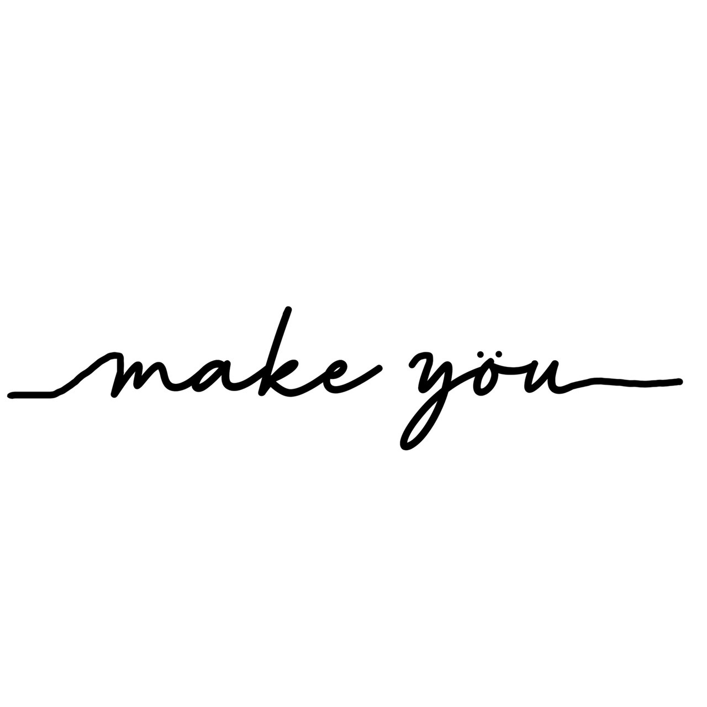

---

## コンセプト 🌿

---

What can we make you ... ?  
It’s totally up to you !!

---

> 「私たちの作ったものが、あなたをかっこよく、  
> かわいく、幸せに、そしてあなたの日常に新しい瞬間を作れたら」
>
> 「あなたにとっての ”my- (私の特別な何か)” を  
> 見つけるちいさな支えになれたら」

make yöu はそんな思いを込めてショップを運営しています。

[make yöu のオンラインショップはこちら](https://makeyou-my.stores.jp/)

[make yöu のインスタグラムはこちら](https://www.instagram.com/makeyou_my/?hl=ja)

---

make yöu は私と友人の２人、沖縄で運営しています。

ただショップを運営するだけでなく  
環境にできることも考えました。

make yöu では商品の梱包にプラスチック製ではなく  
紙製のものを使用しています。  
また、商品の代金の一部を沖縄の海の保全活動をしている団体に  
寄付させていただきます。

「だれか」の気持ちを変えるモノを提供するだけでなく、  
沖縄や環境にも貢献できるような活動をしていきたいと思い  
ショップを運営していきます。
