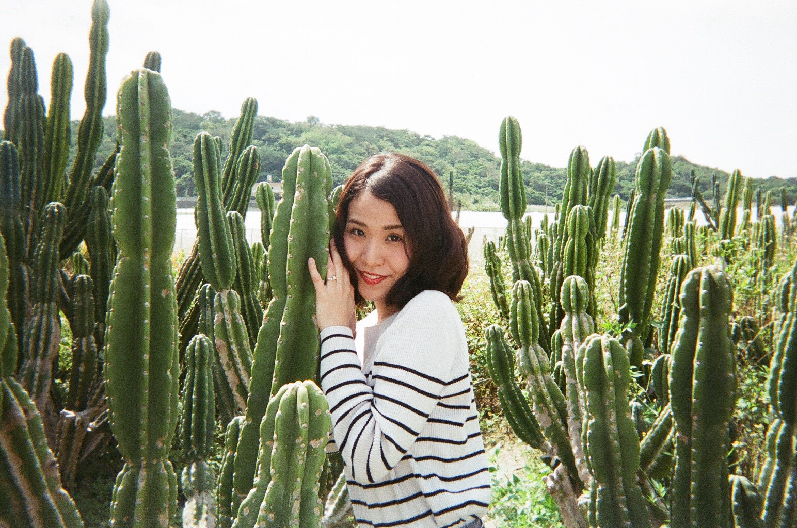

---

---

## あなたの「作りたい」を全力サポート

### web ページ制作、アプリ開発、動画制作・編集、英訳翻訳任せください！！

---

## 作成サイト

琉成工業 様 ホームページ

https://ryuseikougyo.studio.design/

<!-- ### BAR SMILE 様 ホームページ

https://barsmile.studio.design/  -->

## 作成アプリ

旅行のお悩み解決！my trip！  
https://play.google.com/store/apps/details?id=com.sunabakoza.mytrip&hl=ja
旅行者用に todo リストで持ち物・行きたい場所をリスト化でき、住所入力すると google map 上で場所を表示するアプリ。  
 
 
※Android アプリとしてリリースしておりますが  
Android・Iphone アプリの両方作成可能です。

## その他スキル

・動画編集  
動画編集も行なっております。
動画にテロップ・BGM つけたり、カット編集、  
英語字幕付けなどを行います。

運営している youtube チャンネル  
https://www.youtube.com/channel/UCpWDGXn8Vc72uPSqITUVWlQ?view_as=subscriber

 

・英訳翻訳  
英訳、日本語訳の業務も行います。  
機会的な直訳ではなく、意味に忠実にかつ自然な翻訳を  
心掛けています。  
英訳の場合、最初に私が翻訳した後に  
ネイティブによるチェックを行います。

 
・オリジナルブランド
make yöu というオリジナルブランドを立ち上げています。  
詳しい説明は下記から確認ください。

#### [オリジナルブランドについて](https://asaneblog.netlify.app/originambrand/)

  

---

お仕事の依頼は各 SNS の DM よりお気軽にお問い合わせください。
 

[Instagram](https://www.instagram.com/asane108/?hl=ja)はこちら

[Twitter](https://twitter.com/asa1084)はこちら
